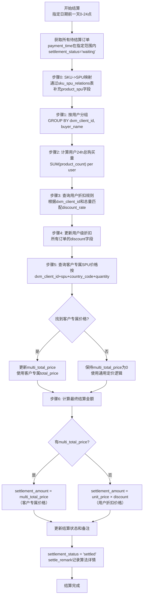

# 订单结算系统 (Settlement System)

## 🎯 系统概述

Syntax Dropshipping 订单结算系统是一个复杂的双重折扣计算引擎，支持基于客户的个性化定价和用户购买量的阶梯折扣。

### 核心特性
- ✅ **双重折扣机制**：用户级折扣 + 客户专属价格
- ✅ **分表支持**：支持订单分表存储和查询
- ✅ **批量结算**：支持单日和批量日期结算
- ✅ **幂等性**：支持重复结算，不会重复计算
- ✅ **客户专属定价**：基于 dxm_client_id 的个性化价格
- ✅ **实时统计**：结算状态和金额统计
- ✅ **管理后台**：完整的管理员操作界面

## 🏗️ 系统架构

### 数据流程图



### 核心算法

#### 1. SKU到SPU映射
```sql
-- 通过sku_spu_relations表获取product_spu
UPDATE orders_X o 
LEFT JOIN sku_spu_relations sr ON o.product_sku = sr.sku 
SET o.product_spu = sr.spu 
WHERE o.payment_time BETWEEN ? AND ?
```

#### 2. 用户级折扣计算
```sql
-- 按用户分组，计算24小时总购买量
SELECT dxm_client_id, buyer_name, SUM(product_count) as total_quantity
FROM orders_X 
WHERE payment_time BETWEEN ? AND ?
GROUP BY dxm_client_id, buyer_name

-- 根据总量查询折扣规则
SELECT discount_rate FROM user_discount_rules 
WHERE dxm_client_id = ? 
  AND min_quantity <= ? 
  AND max_quantity >= ?
ORDER BY min_quantity DESC
LIMIT 1
```

#### 3. 客户专属SPU价格查询
```sql
-- 查询客户专属价格（关键改进：增加了dxm_client_id）
SELECT total_price FROM spu_prices 
WHERE dxm_client_id = ?     -- 客户专属
  AND spu = ? 
  AND country_code = ? 
  AND quantity = ?
```

#### 4. 最终结算金额计算
```sql
-- 优先使用客户专属价格，否则使用用户折扣
UPDATE orders_X SET 
  settlement_amount = CASE 
    WHEN multi_total_price > 0 THEN multi_total_price
    ELSE unit_price * discount
  END,
  settlement_status = 'settled',
  settle_remark = '结算算法说明'
WHERE payment_time BETWEEN ? AND ?
```

## 📊 数据库设计

### 关键表结构

#### 1. 订单表 (orders_0 ~ orders_9)
```sql
CREATE TABLE orders_X (
  id int NOT NULL AUTO_INCREMENT,
  dxm_client_id int NOT NULL COMMENT '店小蜜客户ID',
  buyer_name varchar(100) COMMENT '买家姓名',
  product_sku varchar(50) COMMENT '商品SKU',
  product_spu varchar(50) COMMENT '商品SPU',
  country_code varchar(5) COMMENT '国家代码',
  product_count int DEFAULT 1 COMMENT '商品数量',
  payment_time datetime COMMENT '付款时间',
  unit_price decimal(10,2) DEFAULT 0.00 COMMENT '单价',
  multi_total_price decimal(10,2) DEFAULT 0.00 COMMENT '多件总价',
  discount decimal(5,2) DEFAULT 0.00 COMMENT '折扣率',
  settlement_amount decimal(10,2) DEFAULT 0.00 COMMENT '结算金额',
  settlement_status enum('waiting','cancel','settled') DEFAULT 'waiting',
  settle_remark text COMMENT '结算说明',
  -- 其他字段...
  PRIMARY KEY (id),
  KEY idx_dxm_client_id (dxm_client_id),
  KEY idx_payment_time (payment_time),
  KEY idx_settlement_status (settlement_status)
);
```

#### 2. SPU价格表 (spu_prices) - 已包含客户字段
```sql
CREATE TABLE spu_prices (
  id INT AUTO_INCREMENT PRIMARY KEY,
  dxm_client_id INT NOT NULL COMMENT '店小蜜客户ID',  -- 关键改进
  spu VARCHAR(50) NOT NULL COMMENT 'SPU编号',
  country_code VARCHAR(10) NOT NULL COMMENT '国家代码',
  quantity INT NOT NULL DEFAULT 1 COMMENT '数量',
  total_price DECIMAL(10,2) NOT NULL COMMENT '总价',
  -- 成本字段...
  UNIQUE KEY uk_spu_client_country_qty (spu, dxm_client_id, country_code, quantity),
  INDEX idx_dxm_client_id (dxm_client_id),
  INDEX idx_spu_client (spu, dxm_client_id)
);
```

#### 3. 用户折扣规则表 (user_discount_rules)
```sql
CREATE TABLE user_discount_rules (
  id INT AUTO_INCREMENT PRIMARY KEY,
  dxm_client_id INT NOT NULL COMMENT '店小蜜客户ID',
  min_quantity INT NOT NULL COMMENT '最小数量',
  max_quantity INT NOT NULL COMMENT '最大数量',
  discount_rate DECIMAL(3,2) NOT NULL COMMENT '折扣率',
  UNIQUE KEY uk_client_quantity_range (dxm_client_id, min_quantity, max_quantity)
);
```

## 🚀 API 接口

### 1. 执行结算
```http
POST /api/admin/settlement/settle
Authorization: Bearer <admin_token>
Content-Type: application/json

{
  "settlementDate": "2024-01-15"
}
```

**响应示例:**
```json
{
  "success": true,
  "message": "结算完成",
  "data": {
    "settlementDate": "2024-01-15",
    "processingTime": "1234ms",
    "processedOrders": 150,
    "settledOrders": 145,
    "userDiscounts": 12,
    "spuPrices": 89,
    "skippedOrders": 5,
    "errors": []
  }
}
```

### 2. 批量结算
```http
POST /api/admin/settlement/batch-settle
Authorization: Bearer <admin_token>
Content-Type: application/json

{
  "startDate": "2024-01-01",
  "endDate": "2024-01-31"
}
```

### 3. 获取统计信息
```http
GET /api/admin/settlement/stats/2024-01-15
Authorization: Bearer <admin_token>
```

### 4. 重新结算
```http
POST /api/admin/settlement/re-settle
Authorization: Bearer <admin_token>
Content-Type: application/json

{
  "orderIds": [1001, 1002, 1003],
  "settlementDate": "2024-01-15"
}
```

### 5. 取消结算
```http
POST /api/admin/settlement/cancel
Authorization: Bearer <admin_token>
Content-Type: application/json

{
  "orderIds": [1001, 1002],
  "reason": "价格调整，需要重新计算"
}
```

## 🔧 使用方法

### 1. 服务器端使用

```javascript
const SettlementManager = require('./utils/settlementManager');

const settlementManager = new SettlementManager();

// 结算指定日期
const stats = await settlementManager.settleOrdersByDate('2024-01-15');
console.log('结算结果:', stats);

// 获取统计信息
const stats = await settlementManager.getSettlementStats('2024-01-15');
console.log('统计信息:', stats);
```

### 2. 测试脚本

```bash
# 运行结算功能测试
node server/scripts/test-settlement.js
```

### 3. API测试示例

```bash
# 执行结算
curl -X POST http://localhost:5001/api/admin/settlement/settle \
  -H "Authorization: Bearer <token>" \
  -H "Content-Type: application/json" \
  -d '{"settlementDate": "2024-01-15"}'

# 获取统计
curl -X GET http://localhost:5001/api/admin/settlement/stats/2024-01-15 \
  -H "Authorization: Bearer <token>"
```

## ⚠️ 重要注意事项

### 1. 数据库要求
- 确保所有相关表已创建（订单分表、SKU-SPU关系表、折扣规则表、SPU价格表）
- SPU价格表必须包含 `dxm_client_id` 字段
- 建议在结算前备份数据库

### 2. 性能考虑
- 大量订单结算时可能耗时较长，建议分批处理
- 分表设计优化了查询性能，但需要正确的路由逻辑
- 建议在低峰期执行批量结算

### 3. 错误处理
- 系统支持部分失败，会跳过有问题的订单
- 所有错误都会记录在返回结果的 `errors` 数组中
- 支持重新结算功能，可以修复错误后重试

### 4. 数据一致性
- 整个结算过程在数据库事务中执行
- 支持幂等操作，重复结算不会产生错误结果
- 结算状态和备注字段提供了完整的审计日志

## 🎯 业务场景示例

### 场景1: 用户级折扣
- 客户444的用户张三在24小时内购买了5件商品
- 根据折扣规则：1-3件9折，4-8件8.5折
- 张三的所有订单都会应用8.5折

### 场景2: 客户专属价格
- 客户444购买SPU-ABC商品到美国，数量为2件
- 系统查询spu_prices表：dxm_client_id=444, spu='SPU-ABC', country_code='US', quantity=2
- 如果找到专属价格$15.99，则使用此价格，忽略用户级折扣

### 场景3: 混合计算
- 同一用户的不同商品可能采用不同的计算方式
- 有专属价格的商品使用专属价格
- 没有专属价格的商品使用 单价 × 用户折扣

## 📈 监控和维护

### 1. 日志监控
- 结算过程的详细日志会输出到控制台
- 错误信息会记录在返回结果中
- 建议配置日志收集系统

### 2. 性能监控
- 监控结算耗时，超过阈值时考虑优化
- 监控数据库连接数和查询性能
- 定期检查分表数据分布是否均匀

### 3. 数据维护
- 定期清理过期的结算日志
- 监控订单分表的数据量增长
- 定期备份关键业务数据

---

🎉 **结算系统已完成开发，支持完整的双重折扣计算和客户专属定价！**
